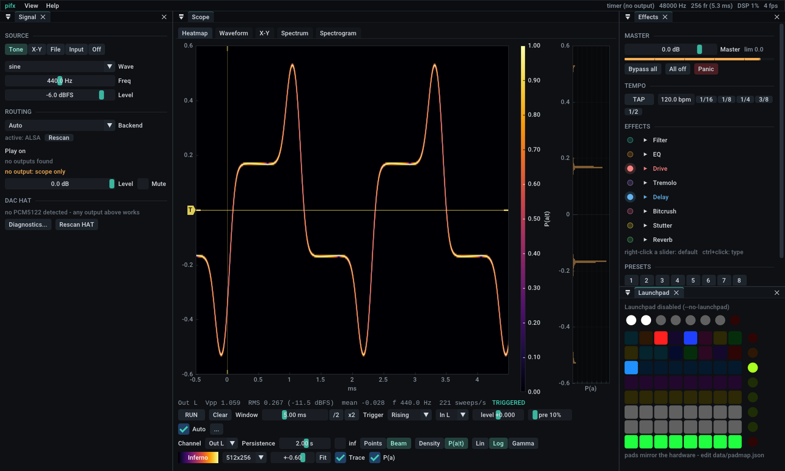
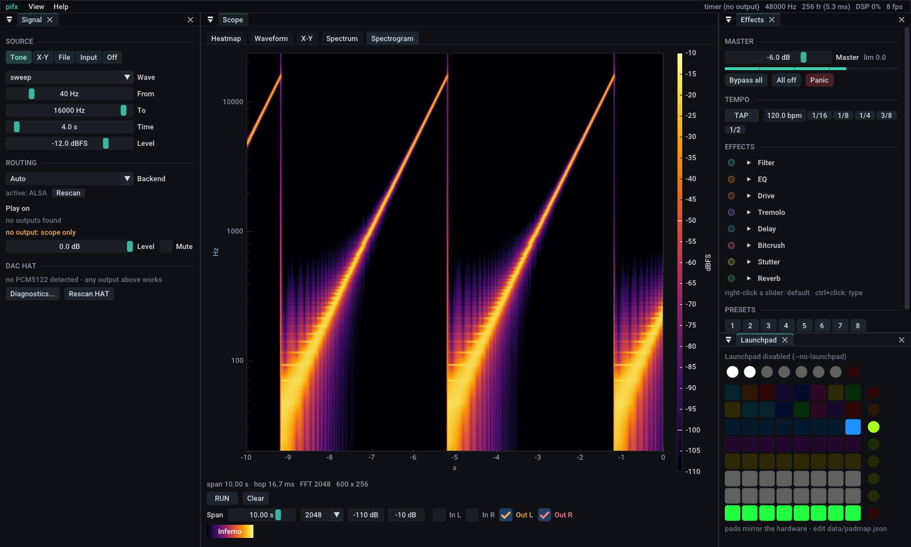
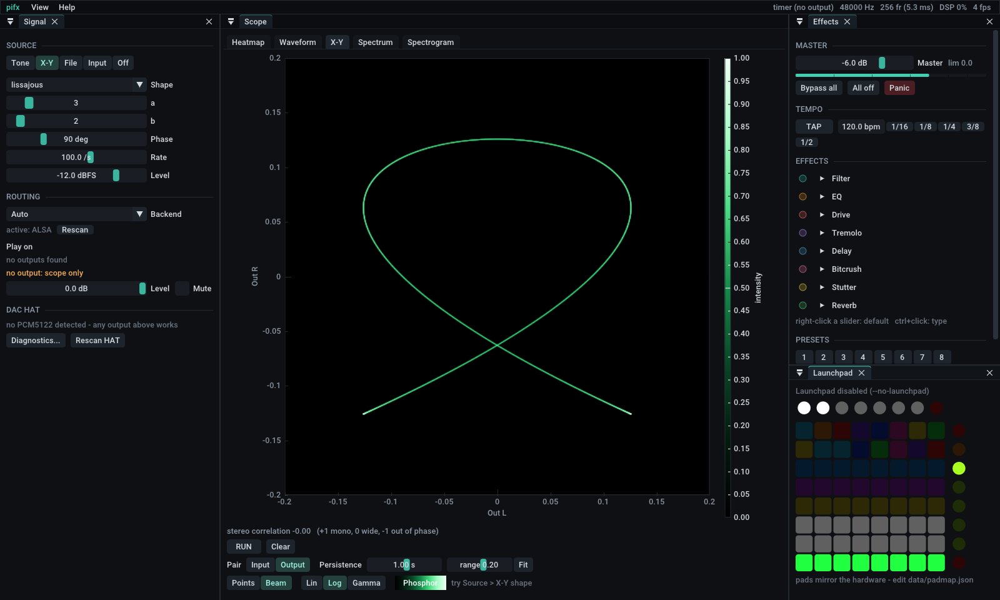
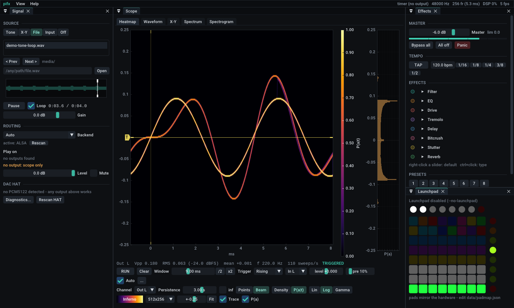

# pifx — waveform scope, audio router and effects box for the Raspberry Pi 5

pifx is a native C++ app (Dear ImGui + ImPlot, OpenGL ES 3) built around **looking at
waveforms**. It plays files, tones and X-Y shapes, taps or hijacks audio already
playing on the Pi, runs it through an effects chain, and sends it to **any outputs you
pick**: the PCM5122 DAC HAT, HDMI, a USB interface, several at once.



- **Probability heatmap** — every triggered sweep is accumulated into a time × amplitude
  grid that decays with a persistence you choose. Show it as raw density or as
  **P(amplitude | time)**, with a marginal **P(amplitude)** beside it. A *Beam* mode draws
  the trace like an analogue phosphor: slow parts glow, fast edges are faint. This is the
  CPU reference for the "ray-traced" renderer described [below](#toward-ray-traced-heatmaps).
- **Adjustable time interval** — the window runs from 100 µs to 20 s on a log slider (or
  the mouse wheel), with a scope-style trigger: rising/falling/both, a level you drag on
  the plot, pre-trigger, holdoff, hysteresis, auto. Sub-sample trigger interpolation means
  a periodic signal is effectively sampled at better than 1/48000 s.
- **Five views** — Heatmap, Waveform (min/max envelope when zoomed out), X-Y phosphor
  (oscilloscope music, stereo phase), Spectrum (In vs Out per channel), Spectrogram.
- **Interface-agnostic audio** — PipeWire/PulseAudio, ALSA or JACK backend. Sources are
  tones/sweeps/noise, X-Y shapes, WAV/FLAC/MP3 files, any capture device, or the
  *monitor* of any output. Play on one or many outputs; **Hijack** reroutes every app on
  the desktop through pifx and back out of the device you choose.
- **Effects chain** (ported from the Python version, same sound): filter, 3-band EQ,
  drive, tremolo, delay, bitcrush, stutter, reverb, plus master gain and a limiter.
  Presets and tap tempo carry over too. All eight effects together use about 2% of one
  core.
- **Launchpad** — Mini MK3, X, Pro MK3, MK2, Pro, S/Mini. The same `padmap.json` works, and
  an on-screen copy of the grid is always visible.
- **DAC HAT** detection, diagnostics and hardware volume (PCM5122 via ALSA mixer).
- Runs **headless** as a service, with the Launchpad still active.

| | |
|---|---|
|  |  |

---

## 1. Install on the Pi

Raspberry Pi OS Bookworm or Trixie, desktop or Lite:

```bash
git clone git@github.com:akakrabz/pi-dsp.git ~/pi-wks && cd ~/pi-wks
./install.sh             # apt packages, DAC overlay, build (a few minutes on a Pi 5), unit tests
sudo reboot              # only if it changed config.txt
pifx diag                # should end with "RESULT : OK - BossDAC (card N ...)"
pifx                     # the GUI
```

`install.sh` installs `build-essential cmake ninja-build libsdl2-dev libgles-dev
libegl-dev alsa-utils pulseaudio-utils`. It adds `dtoverlay=allo-boss-dac-pcm512x-audio`
to `config.txt` (the InnoMaker board is electrically an Allo Boss; use
`--overlay hifiberry-dacplus` for the alternative) and builds into `build/`. It also links
`~/.local/bin/pifx`.

Options: `--service` (runs `pifx headless` at boot as a systemd *user* service, so it can
reach PipeWire), `--autostart` (opens the GUI when the desktop starts), `--debug`,
`--no-overlay`, `--dry-run`.

The third-party libraries (Dear ImGui, ImPlot, miniaudio, nlohmann/json, stb) are fetched
by CMake at pinned versions. Nothing gets installed with pip, and no venv is needed.

## 2. The scope

Keys: **Space** hold/run · **1–5** views · **[ ]** halve/double the window · mouse wheel
over a plot changes the window, **Shift**+wheel the vertical range · drag the yellow
line to set the trigger level · **F11** fullscreen.

### Heatmap (probability)
Each completed sweep, one window of samples aligned on the trigger, is splatted into a
grid (256×128, 512×256 or 1024×512). Every frame the grid is multiplied by
`exp(-dt / persistence)`, so it keeps a fading memory of the last few seconds (or
everything, with **inf**).

| Control | What it does |
|---|---|
| **Points / Beam** | Points bins each sample (with bilinear sub-pixel splatting). Beam draws the line between consecutive samples with equal energy per sample interval, so a slow part of the trace is bright and a fast edge is dim. That is what an analogue CRT does. |
| **Density / P(a\|t)** | Density is normalised to the brightest cell. P(a\|t) normalises every time column to sum to 1, so each column becomes the probability distribution of the amplitude at that instant after the trigger. |
| **Lin / Log / Gamma** | Intensity mapping; Log brings out rare paths (glitches, intermittent notes). |
| **P(a)** | Side plot: overall amplitude distribution of the window. A sine shows its arcsine shape; noise shows a Gaussian; clipping shows spikes at the rails. |
| **Trace** | Overlays the latest sweep as a thin white line. |
| **Window** | The time interval: 100 µs to 20 s. |
| **Persistence** | Decay time constant: 20 ms to 120 s, or infinite. |

Try it: the demo loop (File source) alternates between 220 Hz alone and 220 + 330 Hz, so
the probability cloud splits into two trajectories. Turn on Drive and you see the tops
flatten; add a short Delay and a ghost copy appears.



### Waveform, X-Y, Spectrum, Spectrogram
- **Waveform**: In L/R and Out L/R traces. Windows longer than the plot is wide draw as
  min/max envelopes from a precomputed block pyramid, so a 20 s window costs the same as
  a 2 ms one.
- **X-Y**: left against right as a phosphor heatmap (input or output pair). Use
  Source › X-Y for circles, Lissajous figures, roses and stars. The readout shows stereo
  correlation.
- **Spectrum**: Hann-windowed FFT (1k–16k points), averaging, one curve per channel. Compare
  In and Out to see what the effects do.
- **Spectrogram**: rolling time × log-frequency heatmap, 1–20 s span, dB range and colormap
  adjustable.

## 3. Sources and routing

**Signal › Source**
- **Tone**: sine/square/triangle/saw, white/pink noise, log sweep.
- **X-Y**: shapes for oscilloscope music (L = x, R = y).
- **File**: everything in `media/`, or any path you type. WAV/FLAC/MP3 at any rate, with
  a clickable overview, seek, loop and gain.
- **Input**: any capture device. Entries marked **[monitor]** record what an output is
  playing without changing anything ("tap" mode).
- **Hijack system audio** (PipeWire): creates a virtual output `pifx-hijack`, makes it the
  default and moves every playing app onto it. pifx records it, runs the effects and plays
  it wherever you tick. Turning it off restores the previous default and moves the apps
  back. If pifx crashes mid-hijack, `pifx unhijack` (or the next start) repairs it.

**Signal › Routing**
- **Backend**: Auto (PipeWire/PulseAudio, then ALSA, then JACK), or force one. Use ALSA
  on Pi OS Lite for the lowest latency.
- **Play on**: tick any number of outputs. The first one is the **clock**: its callback
  drives the engine. The others follow through small ring buffers that absorb clock drift.
  With nothing ticked the scope keeps running from a timer (scope-only mode).
- **Level / Mute** apply to all outputs when there is no DAC HAT. With the HAT, the
  **DAC HAT** section controls the PCM5122 itself: digital volume (capped at 0 dB, because
  above that it is digital gain and clips), mute, the analogue −6/0 dB stage, and the
  interpolation filter.

The RCA output is line level at **2.1 Vrms**, which is hotter than most consumer gear.
Feed an amp's FX return, a mixer or monitors, not a guitar input. The 3.5 mm jack has its
own headphone amp.

## 4. Effects, presets, Launchpad
- Each effect has a lamp (on/off) and its parameters. Right-click a slider to reset it,
  Ctrl+click to type a value. **Bypass all**, **All off** and **Panic** (everything back
  to defaults) sit in the Master section. **TAP** plus 1/16…1/2 sets the delay from the tempo.
- **Presets**: 8 slots (click to load, Shift+click to overwrite; they are also the
  Launchpad's fourth row) plus named presets. Presets saved by the old Python version load
  unchanged.
- **Launchpad**: found automatically through ALSA rawmidi and reconnected after unplugging.
  `--midi-port hw:1,0,1` forces a port. The default layout is the same as before:

| Row (top→bottom) | Pads |
|---|---|
| top round buttons | vol +3 dB, vol −3 dB, delay shorter, delay longer, **tap**, filter mode, drive mode, all off |
| 8 | toggles: filter, EQ, drive, tremolo, delay, crush, stutter, reverb |
| 7 | **hold**: stutter, LP 250 Hz, HP 2.5 kHz, delay throw, reverb freeze, crush, fast tremolo, kill |
| 6 | tones: sine 440 / 1 k / 100, square 220, saw 110, white, pink, sweep |
| 5 | X-Y shapes: circle, Lissajous 1:2 / 2:3 / 3:4, rose 3 / 5, star, square |
| 4 | presets 1–8 |
| 3 | delay = 1/32 … 1/2 of a bar |
| 2 | filter cutoff 80 Hz … 10 kHz |
| 1 | volume fader −40 … 0 dB |
| right column | panic, prev file, next file, src: input, src: file, src: tone, bypass, mute |

Edit `data/padmap.json` to change the layout. All the old actions still work, and two new
ones control the scope: `{"action": "view", "view": "spectrogram"}` and
`{"action": "timebase", "factor": 2}`.

## 5. Command line

```
pifx                         GUI
pifx headless                engine + Launchpad, no window (what the service runs)
pifx diag                    DAC HAT report, mixer state, outputs
pifx devices                 outputs, inputs (incl. monitors) with their keys, MIDI ports
pifx tone 1000 3 --level -12 test tone
pifx unhijack                restore PipeWire routing after a crash

--backend auto|pulse|alsa|jack   --output DEV (repeatable, or none)   --input DEV
--source tone|shape|sweep|noise|file[:name]|capture[:dev]|silence     --preset NAME
--rate 48000   --block 256   --data DIR   --media DIR   --no-launchpad   --midi-port P
--fullscreen   --size WxH   --scale 1.5   --view heat|wave|xy|spectrum|spectrogram
--screenshot out.png --frames N      render headless and save a PNG
```

`DEV` is a device key from `pifx devices`, or any part of its name, such as
`--output BossDAC --output HDMI`. Settings persist in `data/settings.json`.

Without a desktop (Pi OS Lite with an HDMI screen) the GUI still runs, straight on KMS:
`SDL_VIDEODRIVER=kmsdrm pifx --fullscreen`.

## 6. Building, debugging, testing

```bash
cmake --preset debug && cmake --build --preset debug     # build-debug/
./build-debug/pifx_tests                                 # 53 tests: DSP, analysis, HAT, Launchpad, rig
cmake --preset asan && cmake --build --preset asan       # AddressSanitizer + UBSan build
cmake --preset headless && cmake --build --preset headless   # no SDL/GL needed
```

`packaging/vscode/` holds a VS Code launch config. `install.sh` copies it to `.vscode/`
(or run `cp -r packaging/vscode .vscode`). Then press **F5** to build the debug preset and
start pifx (GUI, headless or the tests) under gdb. It works on the Pi itself or over VS
Code Remote-SSH from the laptop. On the command line: `gdb --args build-debug/pifx headless`.

The same code builds on any Linux laptop. `--output none` runs it without sound hardware,
and `SDL_VIDEODRIVER=offscreen pifx --screenshot x.png` renders without a display.

### Layout

```
src/core/            no UI code; everything here is unit-tested
  Engine             source -> chain -> outputs; lock-free command queue, tap for the scope
  Devices            backends, device lists, clock + follower outputs (miniaudio)
  Sources            tone / shape / file / capture
  Dsp                effects, smoothing, limiter, chain
  Analysis           History, trigger (Sweeper), Density heatmap, FFT, spectrogram
  Hijack             PipeWire virtual sink via pactl
  Hat, PadMap, Launchpad, Rig (the controller every input goes through)
src/ui/              ImGui front end: App, ScopeView, Signal/Fx/Pad panels, Theme, Gl
tests/               unit tests (no framework needed)
packaging/           systemd user unit, desktop entry, VS Code launch/tasks
```

Threads: each output's audio callback (the clock calls `Engine::render`), one capture
callback, the Launchpad reader, and the UI. The UI never touches audio state directly. It
posts commands into a lock-free queue, and anything the audio thread retires is freed on
the UI thread, so the audio thread never allocates or frees memory.

## 7. Rendering on the Pi, and toward ray-traced heatmaps

The Pi 5's VideoCore VII GPU runs **OpenGL ES 3.1** through Mesa (the standard Pi OS
driver), and that is what pifx uses: ImGui and ImPlot draw with GLES 3, and every heatmap
is a texture that is uploaded each frame. Today the accumulation (splatting, decay,
normalisation) runs on the CPU in `core/Analysis.cpp`, which is plenty for 512×256 at
60 fps and keeps it testable.

The beam model is the starting point for "ray-tracing" the waveform:

1. **GPU beam splatting**: upload each sweep's samples as a vertex buffer, expand every
   segment into a quad in a vertex shader, and in the fragment shader add a Gaussian beam
   profile weighted by `dt / segment length` into a float framebuffer (additive blending,
   `RGBA16F`). Decay becomes one full-screen pass multiplying by `exp(-dt/τ)`.
   `Density::addTrace` (Beam mode) already does exactly this on the CPU, so it serves as
   the reference to compare the GPU output against.
2. **Physically based phosphor**: separate excitation (beam current, spot size from
   intensity) from emission (phosphor decay curves, bloom).
3. **Ray / path view**: treat each sweep as a ray through (time, amplitude) and accumulate
   path density with sub-sample jitter, the same equivalent-time trick the trigger already
   uses. That gives smooth probability fields at very short windows.

The **Window** and **Persistence** controls are already separate, so the renderer can be
swapped behind `Density` without touching the UI.

## 8. Troubleshooting

| Symptom | Fix |
|---|---|
| `diag`: no PCM5122 card | overlay missing → `./install.sh`, reboot; still missing → `--overlay hifiberry-dacplus`; `sudo i2cdetect -y 1` should show 0x4d |
| card listed but silent on a Pi 5 | append `,slave` to the overlay line |
| DAC not in *Play on* | with PipeWire running the card belongs to PipeWire: use the PipeWire backend (the default) and tick the DAC there |
| crackles / underruns in the status bar | `--block 512`; the official 27 W supply; fewer outputs at once (each one adds a drift buffer) |
| hijack does nothing | Routing › Backend must be PipeWire/PulseAudio; `pactl info` must work for your user |
| desktop silent after a crash | `pifx unhijack` |
| Launchpad not found | `pifx devices` should list it under MIDI ports; a powered hub helps if its LEDs flicker |
| GUI won't start over SSH | run `pifx headless`, or `SDL_VIDEODRIVER=kmsdrm pifx` on the Pi's own screen |
| window too small / text tiny | `--scale 1.5` or `PIFX_UI_SCALE=1.5` |

## What happened to the Python version

The Python package (`pifx/`, the web UI and its server, the Python tests) was replaced by
this rewrite and moved to `_trash/python-pifx/`. Its behaviour was ported; nothing was
deleted, and the git history has it all.

| Python | C++ |
|---|---|
| `pifx/dsp.py` | `src/core/Dsp.*` (same effects, parameters and defaults) |
| `pifx/sources.py` | `src/core/Sources.*` (+ FLAC/MP3, + any capture device / monitor) |
| `pifx/engine.py` | `src/core/Engine.*` + `Devices.*` (multi-output, any backend) |
| `pifx/hat.py` | `src/core/Hat.*` |
| `pifx/launchpad.py`, `padmap.py` | `src/core/Launchpad.*`, `PadMap.*` (rawmidi instead of mido) |
| `pifx/rig.py` | `src/core/Rig.*` |
| `web/index.html`, `server.py` | ImGui UI in `src/ui/` |
| `tests/*.py` | `tests/*.cpp` (the same cases, ported) |

The old WebSocket API (`/ws`, `POST /api/cmd`) is not in the C++ version yet. Every
operation it carried exists as a `Rig` method, so it is a thin layer to add back when the
ESP32 panel needs it.
